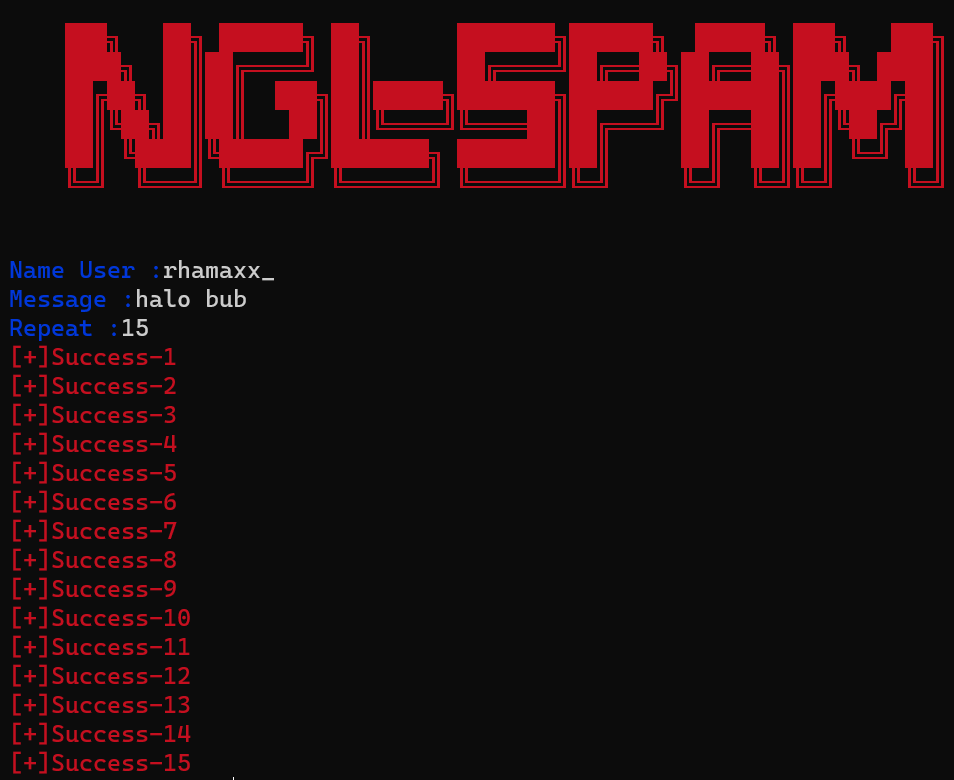

# NGL - SPAMMER
This tool is used to send spam ngl messages to someone like your friend/girlfriend/boyfriend.


## For the first installation

```bash
  pip install colorama
  pip install requests
```
OR

```bash
  pip install -r requirements.txt
```

## To run it
```
  python NGL-Spam.py
```


## Example
 
 Spam and result



